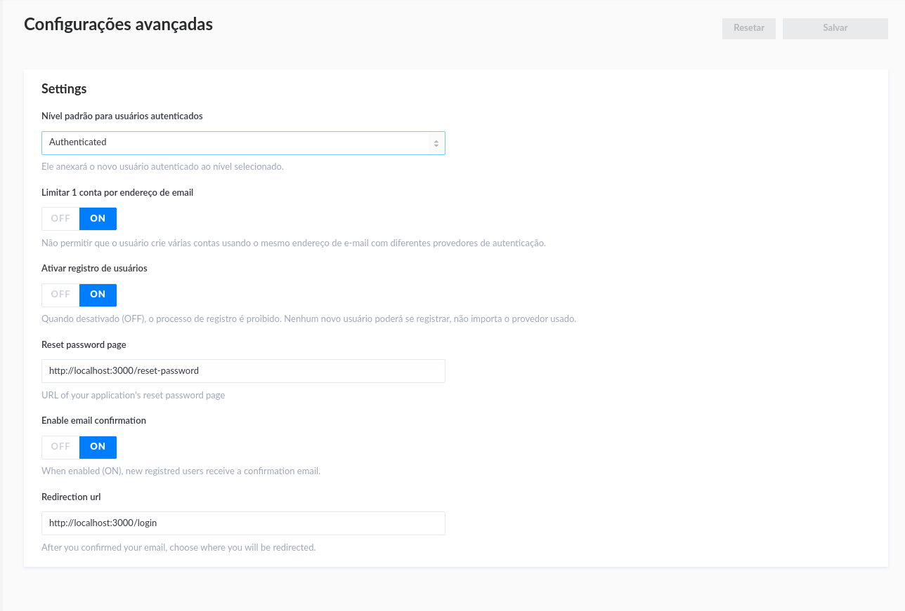

#  Projeto AWARD

Este documento contém instruções de configuração para a execução da aplicação em ambiente de desenvolvimento.


## Stripe

O projeto foi feito usando o serviço de gerenciamento de conteúdo (CMS) Strapi v3. O projeto em sua atual versão encontra-se com dependencias desatualizadas, sendo necessario executa-lo utilizando a versão 14 do node e versão 6 do npm. Veja a seção de ```Executando a Aplicação``` para mais detalhes. O projeto é dividido atualmente em 9 sendo cada painel responsavel  por 8 universidades e 1 painel de controle geral. Cada painel tem seu proprio banco de dados são totalmente isolados uns dos outros


## Frontend

O frontend contém um painel de acesso para consultas externas para usuários que permite aos mesmo realizar operações usando a api do stripe. Assim como o backend, ele também esta desatualizando, precisando executar na versao antiga do node.


## Executando a Aplicação

Primeiro, garanta que você tem todas as variveis de ambiente configuradas para cada painel salvas em um arquivo ```.env```

Antes de rodas a aplicação é imprecindivel que o seu terminal esteja usando a versão 14 do Nodejs. Para saber qual versão você esta usando, execute no terminal
```bash
node -v
```
Caso esteja em uma versão diferente você pode alterar da seguinte forma:

- Linux
  - Instale o nvm 
    ```bash 
    curl -o- https://raw.githubusercontent.com/nvm-sh/nvm/v0.40.0/install.sh
    ```
  - Intale o node 
    ```bash 
    nvm install 14
    ```
  - Agora só torcar para a verso 14
    ```bash
    nvm use 14
    ```

Depois navegue para cada pasta do projeto e instale suas dependencias executando ```npm install```, incluindo também a pasta ```middleware```.

Você pode executar um painel por vez caso precise, onde basta executar o comando ```npm run develop``` na pasta do respectivo painel.

Lembrando que é impresindivel que ao menos o painel geral ```capa-award-api/capa-award-api-master``` pois ele é necssario para o carregamento da landing page no front end.

Caso queria executar todos os paineis de uma unica vez, você pode executar ``` npm install ```, na raiz do projeto ```capa-award-api``` e depois o comando ```npm run dev```. Esse comando executa um script que irá executar todos os paineis de uma única vez. Ao finalizar a montagem, voce pode acessar a rota  ```http://localhost:5173```.

Essa rota irá lhe redirecionar para uma pagina onde você pode escolher o painel que vai acessar e entao sera redirecionado para ele.

Por fim, para executar o painel frontend, vá na pasta ```capa-award-web/capa-award-web-main``` execute o ```npm install``` e depois execute o ```npm run start```. Ele será executado por padrão na rota ```http://localhost:3000```

## Observações

- Caso substitua a porta em que o frontend esta sendo executado, é imprescindivel que altere as seguinte configurações em cada painel 

Navegue para ``` Geral > Configurações > Advanced Settings ```


Altere as rotas de acordo com a nova porta configurada. Faça isso em cada um dos paineis